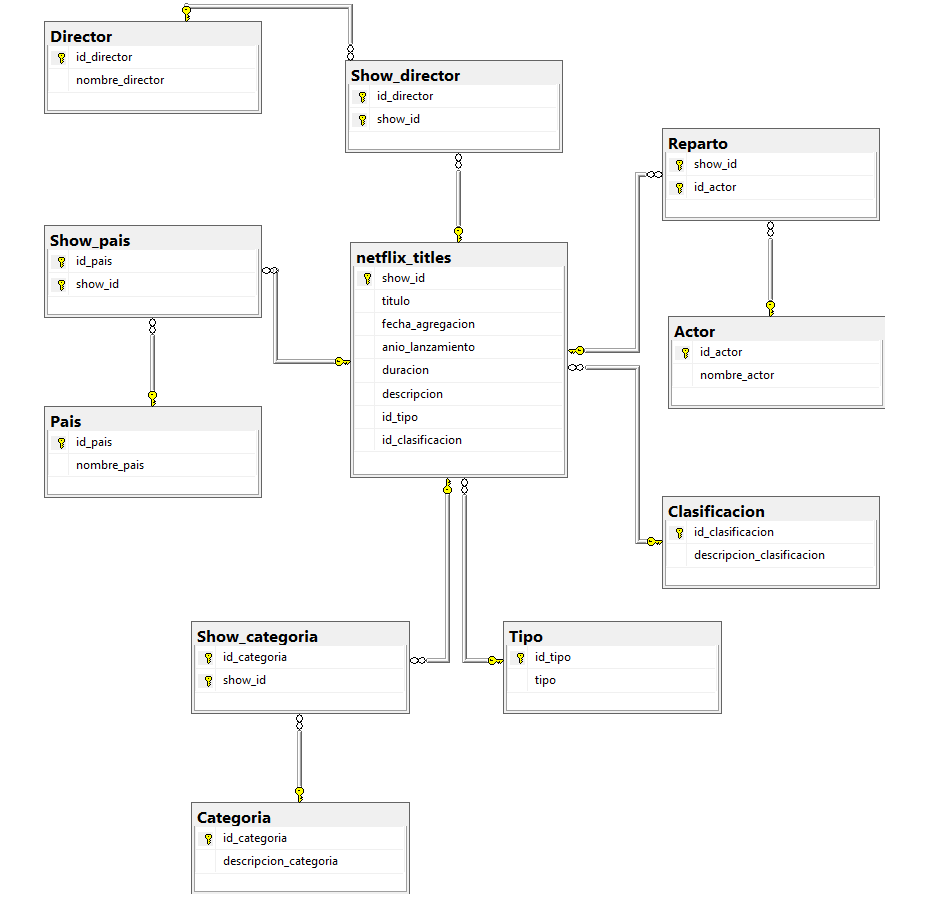

# 📊 Normalización de Base de Datos – Netflix

Este proyecto consiste en la **normalización de una base de datos de Netflix**, partiendo de una tabla desordenada y poco eficiente, hasta llegar a un **modelo relacional normalizado** que permite realizar consultas claras y escalables.

---

## 🎯 Objetivo del proyecto

- Transformar una tabla original con datos redundantes
- Diseñar un modelo relacional normalizado
- Facilitar el análisis de datos mediante consultas SQL
- Aplicar buenas prácticas de modelado de bases de datos

---

## 🗂️ Estructura del repositorio

📁 scripts/
├── netflix_titles.sql
├── netflix_script.sql
└── consultas_verificacion.sql

📁 diagramas/
└── diagrama_netflix.png

📁 data/
└── netflix_titles.xlsx

---

## 🛠️ Tecnologías utilizadas

- SQL
- Modelado relacional
- Normalización de bases de datos
- SQL Server 

---

## 📐 Modelo de datos

El modelo fue diseñado aplicando **normalización** para eliminar redundancias y mejorar la integridad de los datos.

📌 Diagrama relacional disponible en la carpeta `diagramas/`.

---

## 📈 Consultas y validaciones

El archivo `consultas_verificacion.sql` contiene consultas utilizadas para:
- Verificar relaciones
- Validar integridad de datos
- Realizar análisis básicos

---

## 🚀 Sobre el proyecto

Este proyecto forma parte de mi proceso de aprendizaje en **análisis de datos**, con foco en bases de datos y SQL.

> *“De una tabla desordenada a un modelo que permite hacer preguntas.”*
